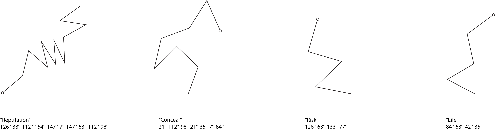
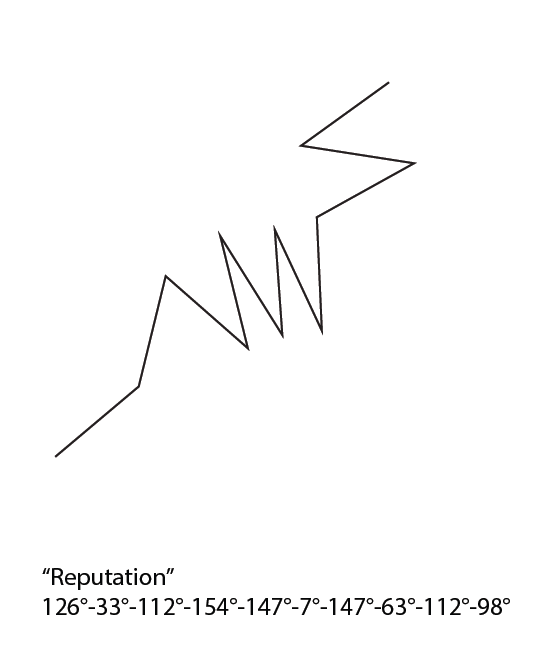

#Vector Pi (⦨)

A universal standard of representation for all languages based on geometry.

- A universal language; translatable into any and all character sets in any and all language.
- A one font language
- A language that visualizes the space between the characters instead of the characters themselves.
- AR translation with smartphones
- All words are the same physical width
- A defined character set is impossible
- Its not a language itself, it is a uniform standard of representation for all languages
- non-verbal
- Approach from a perspective of language and linguistics instead of art and aesthetics.
- Is it a language or a code?

- Never constant
- Think of braille, think of shorthand

###How can this relate to a space?

- Pick a text. 
- Visualize it all connected (it will take on a direction of its own). 
- Pick a physical location on the floor (using the buildings floorplans). 
- Lay the form on that floor.
